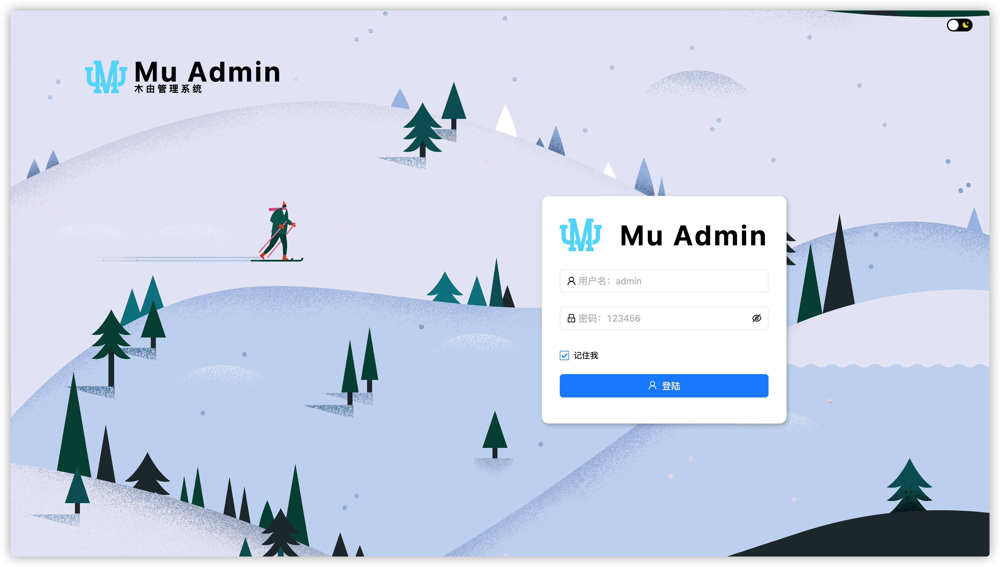
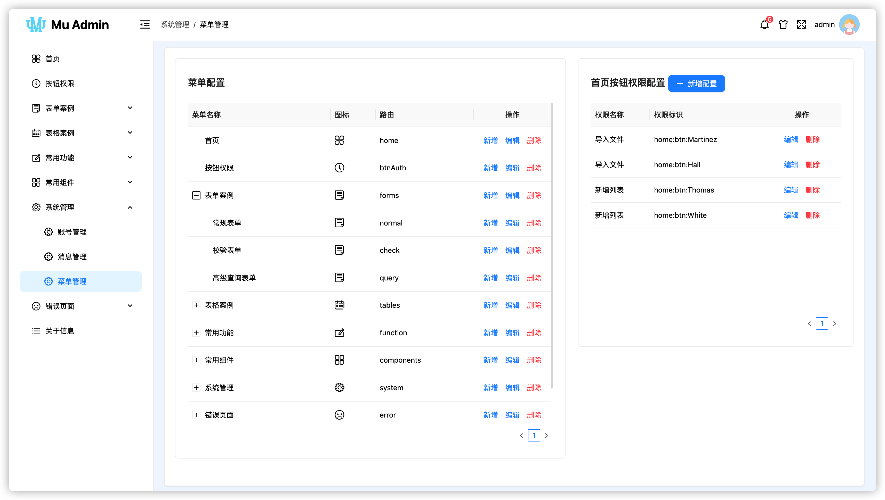
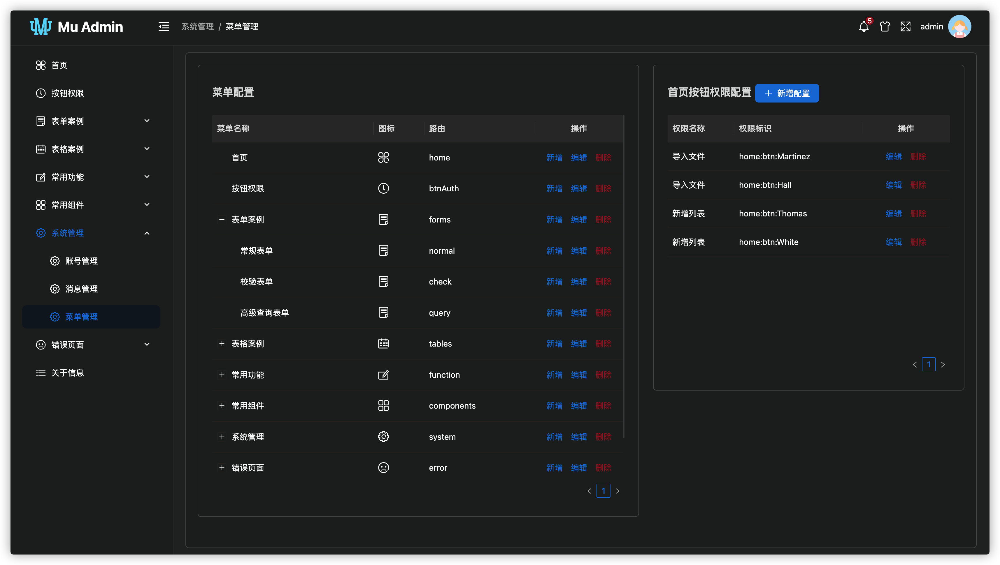

<div align="center">
    
	<p align="center">
		<a href="https://react.docschina.org/" target="_blank">
			
		</a>
		<a href="https://4x.ant.design/docs/react/introduce-cn" target="_blank">
			
		</a>
		<a href="https://www.tslang.cn/" target="_blank">
	        
	    </a>
		<a href="https://vitejs.dev/" target="_blank">
		    
		</a>
		<a href="./LICENSE" target="_blank">
		    
		</a>
	</p>
    <h1>React mu admin</h1>
	<p>&nbsp;</p>
</div>

## ⚡ 简介

React mu admin， 基于 `React18`,`TypeScript`,`vite4`,`antd4.x`等相关主流技术开发，一个免费开源的中后台管理系统开箱即用的前端解决方案，也可适用于学习`React`时进行参考或练手的项目。

## 🌈 特性

-   **主题切换**：普通、暗黑主题模式
-   **Mock 数据**： 内置 Mock 数据方案
-   **用户管理**：登录、登出演示、账号管理
-   **权限管理**：路由权限（动态路由）、组件权限（按钮）
-   **组件**： 二次封装常用组件（空状态、表格、表单、弹窗、上传文件、水印）等
-   **错误页面**: 403、404 页面
-   **多代理配置**：开发环境（development）配置多个本地代理
-   **其他内置功能**：伸缩侧边栏、面包屑、全屏等

## 📚 预览

-   [react-mu-admin](http://mu.haojiey.cn/) - 预览站点

<p align="center">
    
    
    
    
</p>

## ⭐ 仓库地址

-   [https://github.com/haojiey/react-mu-admin](https://github.com/haojiey/react-mu-admin)：- GitHub 仓库，⭐ 欢迎 Star，感谢支持

## 🔨 安装

-   克隆项目

```bash
git clone https://github.com/haojiey/react-mu-admin.git
```

-   安装依赖

```bash
cd react-mu-admin

cnpm install
yarn install
//安装失败，请升级 nodejs 到 16 以上
```

-   运行项目

```bash
npm run start
yarn start
```

-   打包项目

```bash
npm run build
yarn build
```

## 🌈 线上接口

本地采用 Mock 数据，线上采用 EasyMock：

-   EasyMock：https://mock.mengxuegu.com/

## 🔨 Git 提交规范

-   `feat` 增加新的功能
-   `fix` 修复 BUG
-   `perf` 优化功能
-   `style` 代码风格调整不影响运行结果的
-   `refactor` 重构代码
-   `revert` 撤销修改
-   `test` 测试相关
-   `docs` 文档和注释相关
-   `chore` 依赖更新/脚手架配置修改等
-   `workflow` 工作流改进
-   `ci` 持续集成
-   `types` 类型定义文件更改
-   `wip` 开发中

## 📑 浏览器支持

|  |  |  |  |
| :-: | :-: | :-: | :-: |
| last 2 versions | last 2 versions | last 2 versions | last 2 versions |

## 🍵 捐赠

如果你觉得这个项目对你有帮助，欢迎点一个 star 或者帮作者买一杯咖啡表示支持，让作者继续筹资维护线上环境的运行

|                          微信                          |
| :----------------------------------------------------: |
|  |

## 💯 交流

帮助开发者更方便地进行系统的了解，以及同伴们之间的互相交流学习

|                      微信二维码                       |
| :---------------------------------------------------: |
|  |

## License

[MIT License Copyright (c) 2023 梁木由](./LICENSE)
